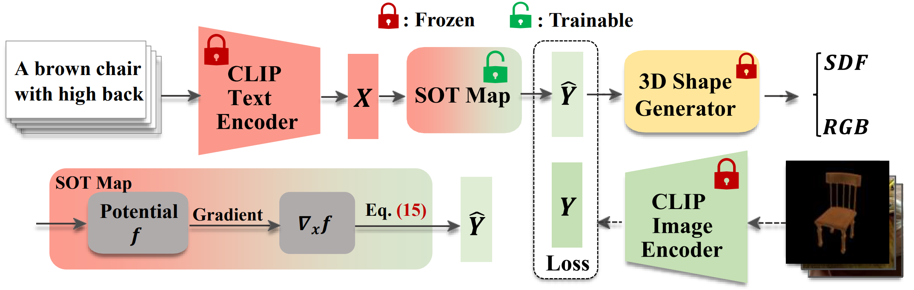
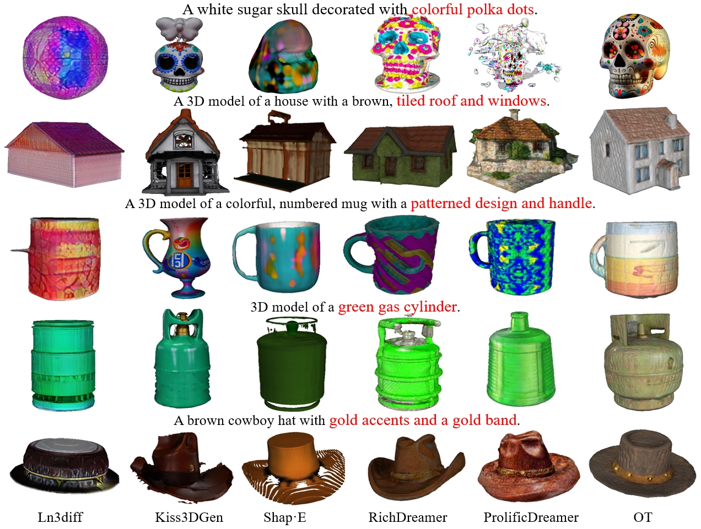

# HOTS3D
Hyper-spherical Optimal Transport for Semantic Alignment in Text-to-3D End-to-end Generation
[](https://arxiv.org/pdf/2407.14419)
[](https://ieeexplore.ieee.org/abstract/document/11072368?casa_token=YObIajrfxCwAAAAA:3afmFQySRCqSUCNGxnIHmftxx00ZaRb2WgnVBk-j7rcfVemyBCYERZjFytl-X2viwHGwMMix63piBQ)

## Introduction

Our framework for text-guided 3D synthesis comprises three stages. Firstly, we encode the input text prompt onto the hypersphere with a pre-trained CLIP text encoder, obtaining text features. Secondly, the SOT map is induced by the gradient of a convex function that is trained via minimax optimization, and then transfers output text
features to the image feature space. In the third stage, a generator conditioned on the output of the SOT Map was utilized to generate 3D shapes. The SOT map is a plug-
and-play tool for aligning spherical distributions. During the training phase, we only need to optimize the parameters
of the SOT map, and other modules remain frozen, significantly reducing the training difficulty. With the SOT map for semantic alignment, our HOTS3D can bypass iterative
optimization during the testing phase, resulting in stronger generalization capability and semantic consistency.

## Performences


## Usage
### Install requirements using the following scripts.
```bash
git clone https://github.com/cognaclee/HOTS3D.git
cd HOTS3D

conda env create -y environments.yml

conda activate HOTS3D

# install pytorch
pip install torch==2.0.1+cu118 torchvision==0.15.2+cu118 torchaudio==2.0.2 --index-url https://download.pytorch.org/whl/cu118
```
### Data Preparation
1. **Download and preprocess the datasets**

   For Text2shape, first download [ShapeNet](https://shapenet.org/) dataset in .obj format, and then download the corresponding [Text Descriptions](http://text2shape.stanford.edu/dataset/captions.tablechair.csv) from [Text2shape](http://text2shape.stanford.edu/) website. Ensure both the ShapeNet dataset and Text Descriptions file are placed in the same directory.

    Next, configure the ```data_dir``` in [obj2imgTextPair.py](./preprocess/obj2imgTextPair.py) script to point to **your Text2Shape directory** and  ```save_root``` to the path where you want the rendered images to be stored. Finally, run the script to generate the image-text pairs. 
	```bash
	## Note that the mesh data needs to be in .obj format
	python ./preprocess/obj2imgTextPair.py
	```
 
   For Objaverse, download [Rendered Image](https://huggingface.co/datasets/tiange/Cap3D/tree/main/misc/RenderedImage_zips) and [Text Descriptions](https://huggingface.co/datasets/tiange/Cap3D/blob/main/misc/Cap3D_automated_Objaverse.csv) of Objaverse from [Cap3D](https://huggingface.co/datasets/tiange/Cap3D).
   
2. Set the **dataset name and paths** and run the script to get **paired CLIP image-text features** for training.
	```
	python ./proprocess/save CLIP_feature.py
	```

### Run HOTS3D
1. **Train**
   
   Set ```text_dir``` and ```img_dir```  in ```train.py``` as **your data path**, then
   
	```bash
	python ./script/train.py
	```
3. **Test**
   
   Set the ```text_file``` in ```inference.py``` to **to your prompt file in**  ```.txt``` format, and ```OT_model``` to the path of the **pretrained SOT model**, then
   
	```bash
	python ./script/inference.py
	```
 4. **Metrics Evaluation**
    Set ```data_dir``` in [obj2img.py](./preprocess/obj2img.py) as **the generated mesh path**, then
   
	```bash
	python ./preprocess/obj2img.py
	```
   
    Set ```image_dir``` in [clip_r_precision.py](./script/clip_r_precision.py) as **the generated image path** in the previous step, then
   
	```bash
	python ./script/clip_r_precision.py
	```
     Set ```pred_dir``` in [f-score.py](./script/f-score.py) as **the generated mesh path**, then
   
	```bash
	## Note that the mesh data needs to be in .obj format
	python ./script/f-score.py
	```

## Acknowledgment

Our code uses <a href="https://github.com/openai/shap-e">shap-e</a> as the backbone. 

ICNN for SOT map from <a href="https://github.com/locuslab/icnn">icnn</a>.

Dataset from <a href="https://github.com/kchen92/text2shape/">text2shape</a>, and <a href="https://huggingface.co/datasets/tiange/Cap3D"> objaverse from Cap3D</a>.

## Citation
If you find our work useful in your research, please consider citing:

```
@article{li2025hyper,
  title={Hyper-spherical Optimal Transport for Semantic Alignment in Text-to-3D End-to-end Generation},
  author={Li, Zezeng and Wang, Weimin and Zhao, Yuming and Li, Wenhai and Lei, Na and Gu, Xianfeng},
  journal={IEEE Transactions on Visualization and Computer Graphics},
  year={2025},
  publisher={IEEE}
}
```
